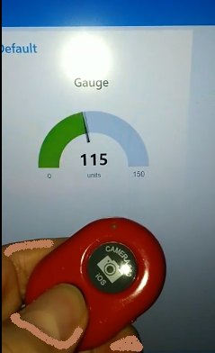
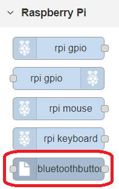
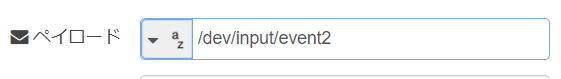
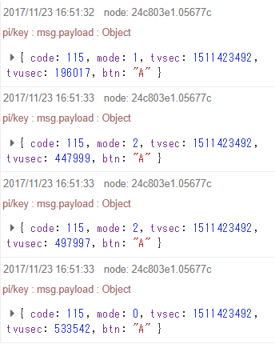
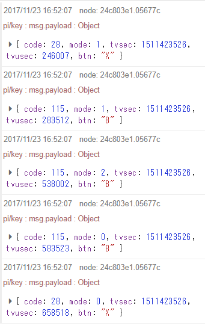
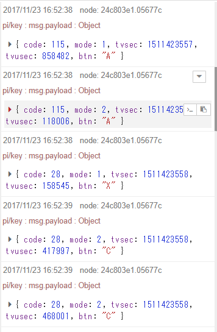
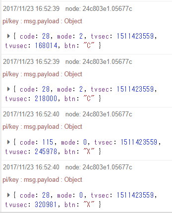

# It is a node that picks up AB-Shutter3's button event. 
This is the Node-RED's node.  
AB Shutter3 is the camera shutter button of Bluetooth.  
AB Shutter3 is sold at the Daiso as of November 2017.  

https://www.youtube.com/watch?v=8WlTP4Ix2uA  

## インストール
注意！　当アプリはRaspberry Pi専用です。当アプリはNode-RED用の追加nodeです。

※ホームフォルダは /home/pi として説明します。

1. ホーム配下の.node-red フォルダに nodes フォルダを作成します
2. GithubからZIPやcloneコマンドなどで取得したファイル全てをnodes配下に置きます  
例）.node-red/nodes/AB-Shutter3
3. 実行権が必要なファイルに実行権を付けます  
cd .node-red/nodes/AB-Shutter3  
sudo chmod -R a+rwx keyaccess.py  

## 設定

### AB-Shutter3のペアリング
1. AB-Shutter3の電源をONします
2. Raspbian GUI画面上部ツールバーのbluetoothアイコンを選び、  
Add Device→ダイアログ→AB-Shutter3選択→何度かダイアログをOKします  
※一度ペアリングすると再起動しても設定は覚えていますが、AB-Shutter3をONするたびに接続許可のダイアログが出てきます
3. AB-Shutter3のデバイス名の確認します  
※Node-REDプログラミング時にデバイス名(/dev/input/event[X])を使用するため調べておきます  

cat /proc/bus/input/devices  

## Node-REDでの使い方

### bluetoothbuttonノードのinputピンに有効なデバイス名を入力すると動き始めます  
  

  
injectノードからデバイス名(/dev/input/event2）を送っている例  

### msg.payload.code, mode, btn で、押したボタンと状態を見れるようにしてあります

#### 大きいボタン（iOSと書いてある）を長押しした場合  

  
code: 115 で modeが　1(push)→2(hold)→0(relese)  
（ボタン種別：btn=A　です）

#### 小さいボタン（androidと書いてある）を長押しした場合  

  
code: 28が入った後（btn=Xにしてあります）、  
code: 115 で modeが　1(push)→2(hold)→0(relese)  
（ボタン種別：btn=B　です）
code: 28が入って終わり（btn=Xにしてあります）

#### 大きいボタンを押しながら小さいボタンを長押しした場合  
  
  
code: 28 で modeが　2(hold)  
（ボタン種別：btn=C　です）  
（不要なイベントにいてはボタン種別：btn=Xにしてあります）  

## 最後に
Node-RED core libraryのソースを元に作成しています。
そのため、元のライセンスと同じ Apache License Version 2.0 にしました。  
ご自由にお使いください。

