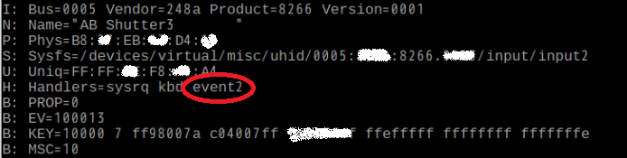

# It is a node that picks up AB-Shutter3's button event. 
This is the Node-RED's node.  
AB Shutter3 is the camera shutter button of Bluetooth.  
AB Shutter3 is sold at the Daiso as of November 2017.  

## インストール
注意！　当アプリはRaspberry Pi専用です。当アプリはNode-RED用の追加nodeです。

※ホームフォルダが/home/piである前提で説明します。

1. .node-red 配下に nodes フォルダを作成します
2. GithubからZIPやcloneコマンドなどで取得したファイル全てをnodes配下に置きます  
例）.node-red/nodes/AB-Shutter3
3. 実行権が必要なファイルに実行権を付けます  
cd .node-red/nodes/AB-Shutter3  
sudo chmod -R a+rwx keyaccess.py  

## 設定

### AB-Shutter3をペアリングします
1. AB-Shutter3の電源をON
2. Raspbian GUI画面上部ツールバーのbluetoothアイコンを選び、  
Add Device→ダイアログ→AB-Shutter3選択→何度かダイアログをOKする  
※一度ペアリングすると再起動しても設定は覚えていますが、AB-Shutter3をONするたびに接続許可のダイアログが出てきます
3. AB-Shutter3のデバイス名の確認  
Node-REDプログラミング時にデバイス名(/dev/input/event[X])を使用するため、調べておきます  
cat /proc/bus/input/devices  

## Node-REDでの使い方

